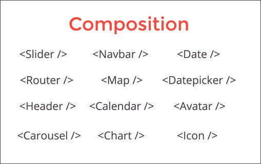
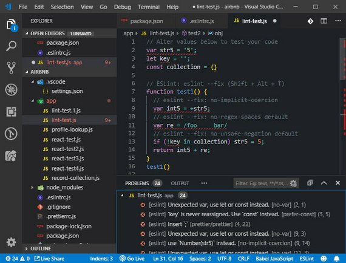
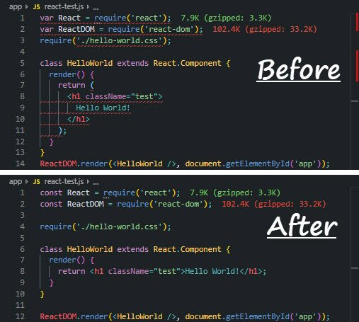
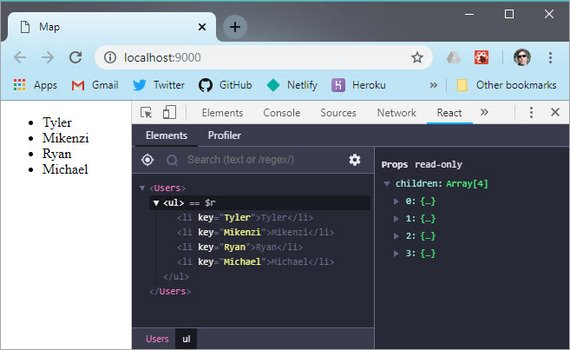
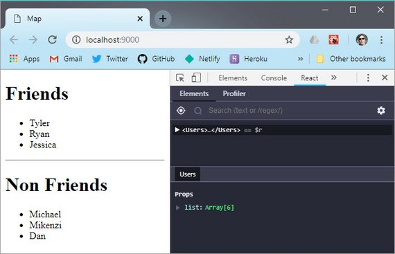
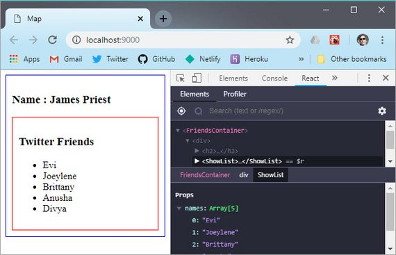
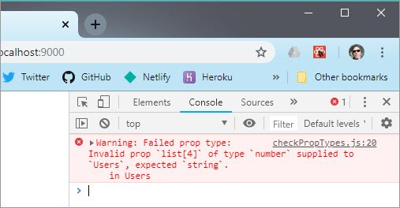
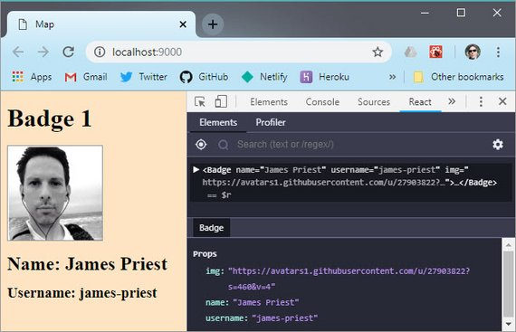
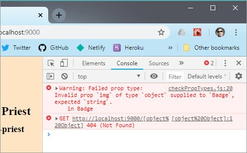
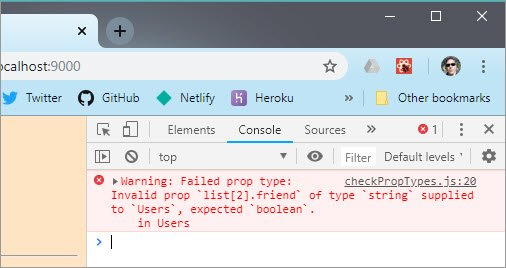

<!-- markdownlint-disable MD022 MD024 MD032 -->
# React Fundamentals
[<– back to React Fundamentals Code Notes homepage](index.html)

[](./assets/images/10.jpg)

---

<!-- These are notes on [Tyler McGinnis' React Fundamentals](https://learn.tylermcginnis.com/courses) course. -->

## 1. Why React

- Composition
- Declarative
- Unidirectional Dataflow
- Explicit Mutations
- Just JavaScript

### 1.1 Composition

This is really means the composition of components.

It allows you to take a certain functionality of a small piece of your application and wrap or encapsulate it into it's own isolated container.

[](./assets/images/1.jpg)

For example, a `<Map />` component will have a lot going on. It may have some state as to the specific location of the map. It may need to make Ajax requests as we scroll in order to update the map images.

What we've done is really taken all the complexity of what is going on for the map and abstracted it behind our `<Map />` component.

What's nice about the component model is the same intuition we use to think about related functions can be applied to components.

How do we build large applications in React? By building a bunch of small apps.

#### Instagram Composition
Here is a view of the Instagram interface. It is composed of many smaller components, each of which may have their own state.

[](./assets/images/2.jpg)

#### Functional Composition
Here is an example of functional composition.

```js
var getProfilePic = function (username) {
  return 'https://photo.fb.com/' + username
}

var getProfileLink = function (username) {
  return 'https://www.fb.com/' + username
}

var getAvatarInfo = function (username) {
  return {
    pic: getProfilePic(username),
    link: getProfileLink(username)
  }
}

getAvatarInfo('tylermcginnis')
```

What we are doing inside of `getAvatarInfo` is we are calling `getProfilePic` and `getProfileLink`.

By doing this we are composing functions together in order to get an object with a `pic` property as well as a `link` property.

What's nice about React is we can use the same intuition we have about functions in order to compose our UI out of components.

#### Component Composition
Here's an example of the same functionality built with components.

```jsx
var ProfilePic = function() {
  return (
    
  )
}

var ProfileLink = function() {
  return (
    <a href={'https://www.fb.comn/' + this.props.username}>
      {this.props.username}
    </a>
  )
}

var Avatar = function() {
  return (
    <div>
      <ProfilePic username={this.props.username} />
      <ProfileLink username={this.props.username} />
    </div>
  )
}

<Avatar username="tylermcginnis" />
```

So instead of composing two functions into another function, we are composing two components into another component.

> The important take-away here is not to get hung up on the implementation, but rather, grasp the idea of separating your interface into components, and then composing those components together.
>
> That's what makes React so powerful is the idea of encapsulating all this complexity into specific components, then composing those components together in order to build the interface.

### 1.2 Declarative

[](./assets/images/3.jpg)

#### Imperative
When write imperative code you are telling the computer **How** to do something.

```js
// Imperative (How)

var numbers = [4,2,3,6]
var total = 0
for (var i = 0; i < number.length; i++) {
  total += numbers[i]
}
```

It the example we are explicitly telling the computer how to add up the numbers by looping through the array and adding to `total` on each iteration.

#### Declarative
When we write declarative code we tell the computer **What** to do.

```js
// Declarative (What)

var numbers = [4,2,3,6]
numbers.reduce(function (previous, current) {
  return previous + current
})
```

Here we are just telling the computer what we want to happen. We want to add the previous item to the current item.

We don't need to concern ourselves with How `.reduce` does this. There is some level of abstraction here and we are trusting the abstraction of `.reduce`.

#### Benefits of Declarative Programming

- Reduce side-effects
- Minimize mutability
- More readable code
- Less bugs

##### Side-effects
In functional programming whenever you are modifying state, or mutating something, or making API requests... those are referred to as side-effects.

By having declarative code, you are reducing the amount of side-effects in your code.

##### Mutability
In our iterative example we have the `total` variable which we are changing on every iteration of the loop. Since we are modifying it on on every iteration, we can't reliably trust it's going to be a certain value at any given time.

In the declarative example we are actually not modifying state, because all of that state modification is happening under the hood of `.reduce`.

Not only are we minimizing side-effects, but we are also minimizing the amount of mutating we are doing to state which is going to make our programs more stable and consistent.

##### More readable
Many times declarative code is going to be more readable because we are not having to mentally iterate through the loop in order to understand what is happening.

##### Less bugs
Because there's less mutability, we introduce less bugs into our code.

#### Imperative vs Declarative Example
Eating at a restaurant.

##### Imperative
You walk in and tell the host, I'd like to:

- walk over to that table
- be given a menu
- decide what I want
- give the waiter my order
- be served my food
- eat

This is very focused on **How**.

##### Declarative
You walk into a restaurant and tell the host, "I am here with my significant other, Do you have a table for two?"

This is focused on the **What**. We are trusting that the host will be able to accommodate the request without us providing explicit instructions on how this is to be accomplished.

#### Is React Declarative

[](./assets/images/4.jpg)

Here is jQuery code that is very imperative because we are telling the computer **How** to handle the state.

##### Imperative

```js
$("#btn").click(function() {
  $(this).toggleClass("highlight")
  $(this).text() === 'Add Highlight'
    ? $(this).text('Remove Highlight')
    : $(this).text('Add Highlight')
})
```

##### Declarative

```html
<TylersBtn
  onClick={this.handleToggleHighlight}
  highlight={this.state.highlight} />
```

Here we have a React component called `TylersBtn`. It runs `handleToggleHighlight` whenever a user clicks the button. We pass in a highlight property which comes from `this.state.highlight`.

State is now being managed from inside the component rather than being managed in the DOM.

Additionally, we can just look at the component to know what is going on rather than have to step through the jQuery in order to know what's happening.

#### Why "for the most part"
Because we need to call `setState` in order to set the `highlight` property and this is very imperative.

```js
this.setState({
  highlight: !this.state.highlight
})
```

### 1.3 Unidirectional Data Flow

[](./assets/images/5.jpg)

The only difference between a static website and a complex web app is **state**.

A static website is probably never going to break because it doesn't have to manage state. FaceBook manages a bunch of state inside the app and therefore, manages lots of data.

> The main purpose of React is for managing state inside your application.
>
> The UI in React is really just a function of your state.

[](./assets/images/6.jpg)

As the state updates, the UI is going to update as well. All we really need to do is worry about managing state in our app for the UI to update according to that state.

### 1.4 Explicit Mutations
[](./assets/images/7.jpg)

Whenever we want to update the state in our application, we have to call `setState`.

```js
this.setState({
  highlight: !this.state.highlight
})
```

What `setStat` is going to do is update the state in the application but it's also going to kick off a re-render.

> Whenever state is updated or whenever we call `setState`, it kicks off a re-render & updates the UI.
>
> In order to update state in a React application, we have to call `setState`

Explicit Mutations means we are not setting event listeners or doing dirty checking. We are specifically calling `setState` so we know exactly when our UI will update. It updates when we explicitly call `setState`.

### 1.5 Just JavaScript

[](./assets/images/8.jpg)

The better you get at using React, the better you'll get at JavaScript.

The React API is pretty small because it relies heavily on the JS API.

```html
<ul>
  {friends.map(function (name) {
    return (
      <li>
        {name}
      </li>
    )
  })}
</ul>
```

Instead of using `ng-repeat` or some other API specific to a framework, we are using JavaScript's built-in methods.

## 2. The React Ecosystem
[](./assets/images/9.jpg)

The React ecosystem is made up of these five basic areas.

- React
- React Router
- Webpack
- Babel
- Axios

### 2.1 React
This is the core React framework.

### 2.2 React Router
This will allow us to map a specific URL with a specific component.

| URL | Active Component |
| --- | --- |
| foo.com | Home |
| foo.com/about | About |
| foo.com/topics | Topics |

```html
<Router>
  <div>
    <ul>
      <li><Link to="/">Home</Link></li>
      <li><Link to="/about">About</Link></li>
      <li><Link to="/topics">Topics</Link></li>
    </ul>

    <Router exact path="/" component={Home} />
    <Router path="/about" component={About} />
    <Router path="/topics" component={Topics} />
  </div>
</Router>
```

We have html that renders three `<Link/>` components and below that we render three `<Router />` components.

The `<Router />` components say:

- If someone goes to "/" then render the `<Home />` component.
- If someone goes to "/about" then render the `<About />` component.
- If someone goes to "/topics" then render the `<Topics />` component.

The nice thing about React Router is that it's just components. `<Link />` is component and `<Router />`is a component that we are composing together.

### 2.3 Webpack
This is an extremely powerful tool that sometimes gets a bad wrap for being more complex than it actually is.

```js
var path = require('path');
var HtmlWebpackPlugin = require('html-webpack-plugin');

module.exports = {
  entry: './app/index.js',
  output: {
    path: path.resolve(__dirname, 'dist'),
    filename: 'index_bundle.js'
  },
  module: {
    rules: [
      { test: /\.(js)$/, use: 'babel-loader' },
      { test: /\.css$/, use: { 'style-loader', 'css-loader' }}
    ]
  },
  plugins: [
    new HtmlWebpackPlugin({
      template: 'app/index.html'
    })
  ],
  mode: 'development'
};
```

What's happening is `index.js` is the entry point and it is going to become the root component in our application.

Webpack will take all the js files along with each `require` statement and run them through the transformations defined under rules.

It'll then bundle all the files into one file, output it to the `dist` folder, and name it `index_bundle.js`

> Webpack is really just a code bundler.
>
> It takes our code in our modules, transforms them, and bundles them.

### 2.4 Babel

> Babel is a code transformer

We need to add an entry to `package.json` which includes instructions on what babel should transform.

```json
"babel": {
  "presets": [
    "env",
    "react"
  ]
}
```

These transformations happen through Webpack and we run two types of transformations.

- `env` - ES6 transformations
- `react` - jsx transformations

### 2.5 Axios
Provides a uniform way of making Ajax requests

```js
function getRepos (username) {
  return axios.get('https://api.gitgub.com/users/' + username + '/repos' +
    param + '&per_page=100' );
}
```

## 3. Imperative vs Declarative
Imperative says **How** and declarative says **What**.

### 3.1 Declarative Languages

Here are some programming languages and where they fall on the spectrum.

| Imperative | Declarative | Mix (Can be) |
| --- | --- | --- |
| C, C++, Java | SQL, HTML | JavaScript, C#, Python |

Here are a couple examples of declarative syntax.

#### SQL

```sql
SELECT * FROM Users WHERE Country='Mexico';
```

#### HTML

```html
<article>
  <header>
    <h1>Declarative Programming</h1>
    <p>Some text about declarative programming</p>
  </header>
</article>
```

### 3.2 Imperative JavaScript

Next we're going to create some imperative code.

1. Write a function called *double* which takes in an array of numbers and returns a new array after doubling every item in that array. *double*([1,2,3]) -> [2,4,6]
   ```js
   function double (arr) {
     let results = []
     for (let i = 0; i < arr.length; i++){
       results.push(arr[i] * 2)
     }
     return results
   }
   ```
2. Write a function called *add* which takes in an array and returns the result of adding up every item in the array. *add*([1,2,3]) -> 6
  ```js
   function add (arr) {
     let result = 0
     for (let i = 0; i < arr.length; i++){
       result += arr[i]
     }
     return result
   }
   ```
3. Using jQuery, add a click event handler to the element which has an id of btn. When clicked, toggle (add or remove) the highlight class as well as change the text to Add Highlight or Remove Highlight depending on the current state of the element.
   ```js
   $("#btn").click(function() {
     $(this).toggleClass("highlight")
     $(this).text() === 'Add Highlight'
       ? $(this).text('Remove Highlight')
       : $(this).text('Add Highlight')
   })
   ```

After examining these three here's what we can say about them.

1. They each describe **How** to do something. We are explicitly iterative over an array or explicitly laying out steps for how to implement the functionality we want.
2. Each example is mutating some piece of state. In the first two we create a variable called `result` and then constantly modify it. The last example tracks state in the DOM rather than in a component.
3. The code isn't very readable. We can't just glance at the code to see what's going on. We actually have to step through it like an interpreter would while also taking into account the context in which the code lives.

### 3.3 Declarative JavaScript
Here we are going to re-write the code to say **What** we want.

1. Create a function to *double* the numbers in an array.
   ```js
   function double (arr) {
     return arr.map(item => item * 2)
   }
   ```
2. Create a function to *add* the numbers in an array and return the sum.
   ```js
   function add (arr) {
     return arr.reduce((prev, current) => prev + current);
   }
   ```
3. Create a highlight toggle component.
   ```html
   <Btn
     onToggleHighlight={this.handleToggleHighlight} 
     highlight={this.state.highlight}>
     {this.state.buttonText}
   </Btn>
  ```

In the first two examples we're using JavaScript's build-in `.map` and `.reduce` methods which provides an abstraction over some imperative implementation.

We are also not mutating any state. The mutations are abstracted inside of *map* and *reduce*.

The third example uses React. By looking at the component we can easily understand what the UI is going to look like. Another benefit is the state is living in the component itself rather than the DOM.

Another benefit of declarative code is that it is not context-dependant. This means the same code can be used in different programs because it is concerned with **What** is supposed to happen rather than the steps it takes to accomplish that goal.

If we look at our three examples above, we can consume those in any program we want. They're program agnostic. That is hard to do with imperative code because often times imperative code relies on the context of the current state.

Functional programming is a subset of declarative programming. We can start getting familiar with functional programming techniques by starting with `.map`, `.reduce`, and `.filter`.

#### Definitions

> Declarative programming is “the act of programming in languages that conform to the mental model of the developer rather than the operational model of the machine”.

> 3 types of programming languages
> - Procedural languages specify an explicit sequence of steps to follow
> - Imperative languages specify explicit manipulation fo the computer's internal state
> - Declarative languages express the logic of the computation without describing its control flow

## 4. React Setup
### 4.1 Npm
Some takeaways for npm are:

- Npm manages modules through `package.json` so we don't have to manage these manually with script tags in the html
  ```html
  <script src="http://cdnjs.cloudflare.com/ajax/libs/jquery/2.1.4/jquery.min.js"></script>
  <script src="libs/jquery.js"></script>
  ```
- `package.json` should be created in the project root with the following.
  ```bash
  npm --init -y
  ```
- Packages should be installed as a dependency or dev-dependency
  ```bash
  npm install -save react react-dom
  npm install --save-dev @babel/core @babel/preset-env @babel/preset-react
  ```
- Npm scripts should be created to simplify tasks
  ```json
  "scripts": {
    "test": "ava 'app/**/*.test.js' --verbose --require ./setup-tests.js",
    "start": "webpack-dev-server --open"
  }
  ```

#### npm installation
Here's the full installation command for all packages used. This can be run at the terminal in one go.

`npm install --save-dev @babel/core @babel/preset-env @babel/preset-react webpack webpack-cli webpack-dev-server babel-loader css-loader style-loader html-webpack-plugin`'

### 4.2 Webpack 4
Why does Webpack exist?

> Webpack, at its core, is a code bundler
>
> It takes your code, transforms and bundles it, then returns a brand new version of your code.

There are really 3 main steps and 3 main things webpack needs to know...

1. The starting point of your application, or your root JavaScript file.
2. Which transformations to make on your code.
3. To which location it should save the new transformed code.

Webpack configuration file should be named `webpack.config.js` and it should live in the root directory of our project.

Next this file needs to export an object which is going to represent the configurations for webpack.

```js
// In webpack.config.js
module.exports = {}
```

#### 1. Entry point
This tells webpack where the entry point of our application is located.

```js
// In webpack.config.js
module.exports = {
  entry: './app/index.js',
}
```

#### 2. Transformations
This tells webpack what transformations to make. This is where **loaders** come in handy. We install these using `npm install --save-dev <package-name>`.

The loaders we'll be using are **babel-loader**, **style-loader**, and **css-loader**.

```js
// In webpack.config.js
module.exports = {
  entry: './app/index.js',
  module: {
    rules: [
      { test: /\.(js)$/, use: 'babel-loader' },
      { test: /\.css$/, use: { 'style-loader', 'css-loader' }}
    ]
  }
}
```

The rules array contains all transformations. Each object contains a regex **test**, and if it matches, it tell webpack which loader to **use**.

#### 3. Output
This tells webpack where to place the output of the transformed code.

```js
// In webpack.config.js
module.exports = {
  entry: './app/index.js',
  module: {
    rules: [
      { test: /\.(js)$/, use: 'babel-loader' },
      { test: /\.css$/, use: { 'style-loader', 'css-loader' }}
    ]
  },
  output: {
    path: path.resolve(__dirname, 'dist'),
    filename: 'index_bundle.js'
  }
}
```

**path** is the directory where the new filename (**index_bundle.js**) should be placed.

#### HTML Template
Here's the directory structure that our app has. Notice that there's no **index.html** in the **/dist** folder.

```text
/app
  - components
  - utils
  index.js
  index.html
/dist
  index_bundle.js
package.json
webpack.config.js
.gitignore
```

We need to implement a plugin that will take our **app/index.html** file and create a copy in **dist/** with a reference to our new **index_bundle.js**.

There's a plugin that does this called *html-webpack-plugin*. We install it with `npm install --save-dev html-webpack-plugin`.

We update our config file with a **plugins** section and set `template` to our original **index.html**.

```js
// In webpack.config.js
module.exports = {
  entry: './app/index.js',
  module: {
    rules: [
      { test: /\.(js)$/, use: 'babel-loader' },
      { test: /\.css$/, use: { 'style-loader', 'css-loader' }}
    ]
  },
  output: {
    path: path.resolve(__dirname, 'dist'),
    filename: 'index_bundle.js'
  },
  plugins: [
    new HtmlWebpackPlugin({
      template: 'app/index.html'
    })
  ]
}
```

Running webpack now will give us two file in our **dist/** folder.

- **index_bundle.js** is the result of taking our entry code and running it through our loaders.
- **index.html** was created on the fly with **HTMLWebpackPluginConfig** and is a copy of our original index.html file located in our **app** folder with a **script** tag referencing the newly created **index_bundle.js** file

**app/index.html**

```html
<!DOCTYPE html>
<html lang="en">
<head>
  <meta charset="UTF-8">
  <title>My App</title>
  <link rel="stylesheet" href="styles.css">
</head>
<body>
  <div id="app"></div>
</body>
</html>
```

**dist/index.html**

```html
<!DOCTYPE html>
<html lang="en">
<head>
  <meta charset="UTF-8">
  <title>My App</title>
  <link rel="stylesheet" href="styles.css">
</head>
<body>
  <div id="app"></div>
  <script src="index_bundle.js"></script>
</body>
</html>
```

The only difference between the two files is that the one in **dist** (which was created with HTMLWebpackPlugin) now has a script tag pointing to **index_bundle.js**.

#### mode
Finally, we need to specify whether we want webpack to run in "production" or "development" mode. Development mode will enable tooling for debugging and faster builds.

```js
// In webpack.config.js
module.exports = {
  entry: './app/index.js',
  module: {
    rules: [
      { test: /\.(js)$/, use: 'babel-loader' },
      { test: /\.css$/, use: { 'style-loader', 'css-loader' }}
    ]
  },
  output: {
    path: path.resolve(__dirname, 'dist'),
    filename: 'index_bundle.js'
  },
  plugins: [
    new HtmlWebpackPlugin({
      template: 'app/index.html'
    })
  ],
  mode: "development"
}
```

#### Run Webpack
In order to run webpack we'll need to install **webpack** and **webpack-cli**. These can be installed as dev-dependencies.

Then we'll need to add a script to our **package.json**

**package.json**

```json
"scripts": {
  "build": "webpack"
},
```

In terminal we can run "**npm run build**" to do a one time run through of your settings then compile your code and output into a dist folder.

To add a watch change **webpack** in your NPM script to run **webpack -w** and that will watch your files and re-execute webpack whenever any of the files Webpack is concerned about changes.

If we want to run a dev server we'll need in install **webpack-dev-server** and add a new script.

**package.json**

```json
"scripts": {
  "build": "webpack",
  "start": "webpack-dev-server --open"
},
```

In terminal we can run "**npm run start**" to start the dev server. It will autoreload when we make changes to our code.

The running instance is in memory so changes won't be reflected in the **dist** folder.

### 4.3 Babel
Babel will actually do the transformations for us. It will transform JSX to JS and will allow us to opt into future version on JavaScript (ES2015, ES 2016, etc.)

The packages we need to install are **@babel/core**, **@babel/preset-env**, and **@babel/preset-react**

## 5. First React Component
### 5.1 Component explained
React components use ES6. Here's an [introduction to ES6 classes](https://strongloop.com/strongblog/an-introduction-to-javascript-es6-classes/) that's pretty good.

```jsx
var React = require('react');
var ReactDOM = require('react-dom');
class HelloWorld extends React.Component {
  render() {
    return (
      <div>Hello World!</div>
    )
  }
}
ReactDOM.render(<HelloWorld />, document.getElementById('app'));
```

Notice that the only method on our class is the **render**. Every component is required to have a render method. The reason for that is render is describing the UI (user interface) for our component.

**ReactDOM.render** takes in two arguments. The first argument is the component you want to render, the second argument is the DOM node where you want to render the component.

In the example above we’re telling React to take our HelloWorld component and render it to the element with an ID of app. Because of the parent/child child relations of React, you usually only have to use ReactDOM.render once in your application because by rendering the most parent component, all child components will be rendered as well.

[This React presentation](http://www.slideshare.net/floydophone/react-preso-v2) talks about why we don't need to worry about HTML, JS, & CSS violation separation of concerns.

The "HTML" that you're writing in the render method isn't actually HTML but it's what React is calling "JSX". JSX simply allows us to write HTML like syntax which (eventually) gets transformed to lightweight JavaScript objects.

React is then able to take these JavaScript objects and from them form a "virtual DOM" or a JavaScript representation of the actual DOM. This creates a win/win situation where you get the accessibility of templates with the power of JavaScript.

Looking at the example below, this is what your JSX is transformed to once webpack runs its transformation process.

```js
class HelloWorld extends React.Component {
  render() {
    return React.createElement("div", null, "Hello World");
  }
}
```

Up until this point we haven’t really emphasized the importance of this new "virtual DOM" paradigm we’re jumping into. The reason the React team went with this approach is because, since the virtual DOM is a JavaScript representation of the actual DOM, React can keep track of the difference between the current virtual DOM (computed after some data changes), with the previous virtual DOM (computed before some data changes). React then isolates the changes between the old and new virtual DOM and then only updates the real DOM with the necessary changes. Read more about it in [React Elements vs React Components](https://tylermcginnis.com/react-elements-vs-react-components/)

In more layman’s terms, because manipulating the actual DOM can be complex, React is able to minimize manipulations to the actual DOM by keeping track of a virtual DOM and only updating the real DOM when necessary and with only the necessary changes. Typically UI’s have lots of state which makes managing state difficult. By re-rendering the virtual DOM every time any state change occurs, React makes it easier to think about what state your application is in.

The process looks something like this,

Signal to notify our app some data has changed→ Re-render virtual DOM -> Diff previous virtual DOM with new virtual DOM -> Only update real DOM with necessary changes.

### 5.2 Element vs Component
See full article [React Elements vs React Components](https://tylermcginnis.com/react-elements-vs-react-components/).

What is React?

> React is a library for building user interfaces. No matter how complex React or the React ecosystem seem to be, this is React at its core — building UIs.

What is an **Element**?

> Simply put, a React element describes what you want to see on the screen. Not so simply put, a React element is an object representation of a DOM node.

It’s important to note that a React element isn’t actually the thing you’ll see on your screen, instead, it’s just an object representation of it. There’s a few reasons for this. 

The first is that JavaScript objects are lightweight — React can create and destroy these elements without too much overhead.

The second reason is React is able to analyze the object, diff it with the previous object representation to see what changed, and then update the actual DOM only where those changes occurred. This has some performance upsides to it.

**React element**

```js
const element = React.createElement(
  'div',
  {id: 'login-btn'},
  'Login'
)
```

What is a **Component**?

> A component is a function or a Class which optionally accepts input and returns a React element.

What happens with JSX?

> JSX is always going to get transpiled to React.createElement invocations (typically) via Babel.

## 6. ESLint, Airbnb, & Prettier
### 6.1 What this solves
I wanted to set up linting and code formatting in VS Code so I could follow good coding practices from the beginning.

[](./assets/images/11.jpg)

In my research I found that most people seem to be using a combination of ESLint, Airbnb, and Prettier to achieve this. Here's what each does.

- **ESLint** highlights errors and formats code according to a set of rules
- **Airbnb** provides an opinionated set of rules for code quality and style
- **Prettier** formats code according to it's own simple set of rules

The difficult part was trying to determine which packages, plugins, & configurations to use. I spent a week trying different recipes and configurations until I found a working solution.

I'm documenting this here so I can reference it later if need be.

> **Note:** I wanted to install these packages globally to avoid having to do a separate local installation each time I started a new project.
>
> This global approach wasn't the best one for a couple reasons.
> 1. A global install caused some libraries to not work well with one another. Some package combinations worked while others did not.
> 2. It's usually best to include the libraries as part of the project so anyone else who clones and works on it will have the benefit of this configuration.

### 6.2 Tools explained

Here are a quick explanation of these tools.

**Prettier & ESLint explained**

- **Prettier** ([https://prettier.io](https://prettier.io/docs/en/index.html)) formats your code and nothing more. It's opinionated and therefore only has a few configurable formatting rules (single or double quotes, semi colon or not, line-endings, etc.). It will reformat your code but does not help with code quality.
- **ESLint** ([https://eslint.org](https://eslint.org/docs/user-guide/getting-started)) handles both code quality AND code formatting (depending on which rules or Style Guide you use). If you use Prettier then you should turn off ESLint's formatting rules and just rely on code quality rules. Some of the config packages we use will do this automatically.
- **Airbnb** ([https://github.com/airbnb/javascript](https://github.com/airbnb/javascript)) Provides a set of code style rules from which to work. This covers possible errors, best practices, and stylistic choices.

**VSCode Extensions**

- [ESLint](https://marketplace.visualstudio.com/items?itemName=dbaeumer.vscode-eslint) - This integrates ESLint syntax highlighting into VSCode. The *eslint* npm package needs to be installed and configured separate from the VSCode extension.
- [Prettier](https://marketplace.visualstudio.com/items?itemName=esbenp.prettier-vscode) - This extension isn't used in our VSCode setup since we'll configure Prettier to run from within ESLint with the help of an eslint plugin package. Also, relying on this extension to integrate with ESLint introduced a host of other issues such as formatting conflicts with VSCode's built in formatter.

**Npm Packages**

To begin with, both [ESLint](https://eslint.org) and [Prettier](https://prettier.io/) npm package libraries must be installed.

- [eslint](https://github.com/eslint/eslint) - core package which the VSCode extension relies on. It highlights errors and can be used to fix/format code from the CLI with `eslint --fix`.
- [prettier](https://github.com/prettier) - code formatting package that eslint uses. It can also format code on the CLI with `prettier --write`.

Here are the npm packages I used for ESLint & Prettier:

- [babel-eslint](https://github.com/babel/babel-eslint) - a wrapper for Babel's parser required by *eslint-plugin-react*.
- [eslint-config-airbnb](https://www.npmjs.com/package/eslint-config-airbnb) - This provides Airbnb's rules for ESLint.
- [eslint-config-prettier](https://github.com/prettier/eslint-config-prettier) - Turns off ESLint formatting rules that conflict with Prettier.
- [eslint-plugin-import](https://www.npmjs.com/package/eslint-config-airbnb) - provides linting and rules around ES2015 import/export syntax.
- [eslint-plugin-react](https://github.com/yannickcr/eslint-plugin-react) - react specific linting rules for ESLint.
- [eslint-plugin-jsx-a11y](https://github.com/evcohen/eslint-plugin-jsx-a11y) - accessibility rules checker on JSX elements for ESLint.
- [eslint-plugin-react-native](https://github.com/Intellicode/eslint-plugin-react-native) - React Native specific linting rules for ESLint.
- [eslint-plugin-prettier](https://github.com/prettier/eslint-plugin-prettier) - ESLint plugin to add Prettier formatting. This runs ESLint followed by Prettier. Use this to integrate Prettier with ESLint workflow and end up with Prettier formatted code. Requires *eslint* & *prettier*.

The following packages also provide formatting but done in a different way. If you want ESLint to apply its rules AFTER Prettier has formatted the code then you can use the packages below.

These format your JavaScript using Prettier FIRST, followed by ESLint SECOND. (Code -> prettier -> eslint -> formatted code). These two package libraries work best for CLI formatting.

- [prettier-eslint](https://github.com/prettier/prettier-eslint) - Use this if you want to apply ESLint's code formatting to the output of Prettier formatted code.
- [prettier-eslint-cli](https://github.com/prettier/prettier-eslint-cli) - The CLI version of *prettier-eslint*. This works on files. *prettier-eslint* operates on strings.

### 6.3 Articles & Reference
These are the videos, articles, and walk-throughs I used for reference.

- YouTube - [How to Setup VS Code + Prettier + ESLint](https://www.youtube.com/watch?v=YIvjKId9m2c) - Wes Bos<br>
  - Referenced [Wes Bos Dot files](https://github.com/wesbos/dotfiles) on GitHub (.eslintrc & .vscode)
- Medium - [Integrating Prettier + ESLint + Airbnb Style Guide in VSCode](https://blog.echobind.com/integrating-prettier-eslint-airbnb-style-guide-in-vscode-47f07b5d7d6a) - Jeffrey Zhen.<br>
  Wes Bos config. Works with global or local packages. Must set these VSCode settings.
  - "beautify.language": { "js": [] }
  - "eslint.autoFixOnSave": true
- freeCodeCamp - [How to integrate Prettier with ESLint and stylelint](https://medium.freecodecamp.org/integrating-prettier-with-eslint-and-stylelint-99e74fede33f) - Abhishek Jain.<br>
  Uses *prettier-eslint* & *prettier-stylelint* to create npm scripts for linting all existing code at once.
- Blog post - [A Prettier JavaScript Formatter](https://jlongster.com/A-Prettier-Formatter) - James Long<br>
  Describes how Prettier works with AST formatting.
- Medium - [Javascript Linting and Formatting with ESLint, Prettier, and Airbnb](https://medium.com/@joshuacrass/javascript-linting-and-formatting-with-eslint-prettier-and-airbnb-30eb746db862) - Joshua Crass<br>
  Great article on setting up React rules, webpack aliases, ignore files, and pre-commit hooks using Husky.
- Blog Post - [How to Setup ESLint and Prettier in VSCode For React Project](https://www.lvguowei.me/post/vscode-eslint-prettier/)<br>
  This shows a good example of VSCode editor config so you can turn off conflicting auto formating.

### 6.4 JavaScript Style Guides
Here are a few style guides for reference.

- [ESLint Recommended](https://eslint.org/docs/rules/) - default rule set used with `eslint:recommended`.
- [Airbnb](https://github.com/airbnb/javascript) - A more opinionated style guide for writing Javascript.
- [Standard Style](https://standardjs.com/rules.html) - The style guide that eliminates semis.

Here's a link to the Awesome ESLint GitHub repo. It is a good jump off point for configs, parsers, plugins, and style guides.

- [https://github.com/dustinspecker/awesome-eslint](https://github.com/dustinspecker/awesome-eslint)

### 6.5 React Starter App
I put this up on a repo so I can easily clone and go.

- [https://github.com/james-priest/react-starter-app](https://github.com/james-priest/react-starter-app)

#### Installation scripts
I also created a set of scripts to get everything installed properly.

These are:

- **install-airbnb** - Installs eslint & airbnb style guide rules
- **install-prettier** - Installs prettier code formatting
- **install-react** - Installs react and react-dom
- **install-dev-env** - Install babel, webpack, & loaders
- **eslint-check** - Checks for custom rule conflicts with Prettier's formatting
- **build** - Builds the React app
- **start** - Starts the webpack dev server

```js
// packages.json
{
  "name": "React App",
  "version": "1.0.0",
  "description": "",
  "main": "index.js",
  "babel": {
    "presets": [
      "@babel/preset-env",
      "@babel/preset-react"
    ]
  },
  "scripts": {
    "install-airbnb": "npx install-peerdeps --dev eslint-config-airbnb",
    "install-prettier": "npm i -D prettier eslint-config-prettier eslint-plugin-prettier",
    "install-react": "npm i --save react react-dom",
    "install-dev-env": "npm i -D @babel/core @babel/preset-env @babel/preset-react webpack webpack-cli webpack-dev-server babel-loader css-loader style-loader html-webpack-plugin",
    "eslint-check": "eslint --print-config . | eslint-config-prettier-check",
    "build": "webpack",
    "start": "webpack-dev-server"
  },
  "keywords": [],
  "author": "",
  "license": "ISC"
}
```

Depending on which branch is being used you may not need to run these.

#### ESLint config
These is the ESLint configuration file along with a set of custom rules.

```js
// eslintrc.js
module.exports = {
  "env": {
    "browser": true,
    "es6": true,
    "node": true
  },
  "parserOptions": {
    "ecmaFeatures": {
      "jsx": true
    },
    "ecmaVersion": 2018,
    "sourceType": "module"
  },
  "extends": [
    "airbnb",
    "plugin:react/recommended",
    "plugin:jsx-a11y/recommended",
    "prettier",
    "prettier/react"
  ],
  "plugins": [
    "react",
    "jsx-a11y",
    "prettier"
  ],
  "rules": {
    "func-names": "off",
    "linebreak-style": "off",
    "no-console": "off",
    "prefer-const": [
      "error",
      {
        "destructuring": "all",
      }
    ],
    "prettier/prettier": ["error"],
    "react/jsx-filename-extension": [
      1,
      {
        "extensions": [
          ".js",
          ".jsx"
        ]
      }
    ],
    "react/prefer-stateless-function": 0
  }
};
```

#### VSCode config
Here are the changes I made to User config

Open Command Palette...(Ctrl/Cmd+Shift+P), then type: Preferences: Open Settings (JSON).

This will open your JSON config file. From there add in the following for automatic code format on save.

```json
{
    "eslint.alwaysShowStatus": true,
    "eslint.autoFixOnSave": true,
}
```

#### Before & After

[](./assets/images/12.jpg)

## 7. Dataflow with Props
### 7.1 Props explained
In this section we discuss how to pass information to our components, just as we'd pass information to a function via arguments.

- React is very good at managing state
- The system for passing data from one component to another child component is through *props*
- Props are to component what arguments are to functions

```jsx
class HelloUser extends React.Component {
  render() {
    return (
      <div> Hello, {this.props.name}</div>
    )
  }
}
ReactDOM.render(<HelloUser name="James"/>, document.getElementById('app'));
```

When we use the component, we're passing in a `name` attribute. This attribute can then be accessed inside the component as `this.props.name`.

### 7.2 Practicing Props
The following three exercises create the same badge app. Each exercise incorporates a more advanced and modular design.

The exercises ask you to pass down the correct props and render the components.

- [Exercise 1 on CodePen](http://codepen.io/tylermcginnis/pen/RpvEvL)
- [Exercise 2 on CodePen](http://codepen.io/tylermcginnis/pen/NpoezB)
- [Exercise 3 on CodePen](http://codepen.io/tylermcginnis/pen/OpdreE)

The final result will look like this.

[](./assets/images/13.jpg)

#### Solution 1

```jsx
class Badge extends React.Component {
  render() {
    return (
      <div>
        <h1>Badge 1</h1>
        
        <h2>Name: {this.props.name}</h2>
        <h3>Username: {this.props.username}</h3>
      </div>
    );
  }
}

ReactDOM.render(
  <Badge
    name="James Priest"
    username="james-priest"
    img="https://avatars1.githubusercontent.com/u/27903822?s=460&v=4"
  />,
  document.getElementById('app')
);
```

Here's the Badge component using destructuring assignment for props.

```jsx
class Badge extends React.Component {
  render() {
    const { name, username, img } = this.props;
    return (
      <div>
        <h1>Badge 1</h1>
        
        <h2>Name: {name}</h2>
        <h3>Username: {username}</h3>
      </div>
    );
  }
}
```

#### Solution 2

```jsx
const USER_DATA = {
  name: 'James Priest',
  img: 'https://avatars1.githubusercontent.com/u/27903822?s=460&v=4',
  username: 'james-priest'
};

class Badge extends React.Component {
  render() {
    return (
      <div>
        <h1>Badge 2</h1>
        
        <h2>Name: {this.props.user.name}</h2>
        <h3>Username: {this.props.user.username}</h3>
      </div>
    );
  }
}

ReactDOM.render(<Badge user={USER_DATA} />, document.getElementById('app'));
```

Solution 2 with destructuring assignment...

```jsx
class Badge extends React.Component {
  render() {
    const { user } = this.props;
    return (
      <div>
        <h1>Badge 2</h1>
        
        <h2>Name: {user.name}</h2>
        <h3>Username: {user.username}</h3>
      </div>
    );
  }
}
```

#### Solution 3

```jsx
class Avatar extends React.Component {
  render() {
    return ;
  }
}

class Label extends React.Component {
  render() {
    return <h2>{this.props.name}</h2>;
  }
}

class ScreenName extends React.Component {
  render() {
    return <h3>Username: {this.props.user}</h3>;
  }
}

class Badge extends React.Component {
  render() {
    return (
      <div>
        <h1>Badge 3</h1>
        <Avatar img={this.props.user.img} />
        <Label name={this.props.user.name} />
        <ScreenName user={this.props.user.username} />
      </div>
    );
  }
}

ReactDOM.render(
  <Badge
    user={{
      img: 'https://avatars1.githubusercontent.com/u/27903822?s=460&v=4',
      name: 'James Priest',
      username: 'james-priest'
    }}
  />,
  document.getElementById('app')
);
```

Solution 3 with destructuring

```jsx
class Avatar extends React.Component {
  render() {
    const { img } = this.props;
    return ;
  }
}

class Label extends React.Component {
  render() {
    const { name } = this.props;
    return <h2>{name}</h2>;
  }
}

class ScreenName extends React.Component {
  render() {
    const { user } = this.props;
    return <h3>Username: {user}</h3>;
  }
}

class Badge extends React.Component {
  render() {
    const { user } = this.props;
    return (
      <div>
        <h1>Badge 3</h1>
        <Avatar img={user.img} />
        <Label name={user.name} />
        <ScreenName user={user.username} />
      </div>
    );
  }
}
```

### 7.3 Lists with map & filter
If you're coming from an Angular background, you're familiar with the idea of '**ng-repeat**'. With React, you can just use JavaScript's native `.map` property.

`.map` allows you to "map" over an array, modify each item in that array, and returns a new array after each item in the array has been modified.

Here's an example of "mapping over" numbers in an array and adding 10 to each item before returning a new array.

```js
var numbers = [1,2,3];
var numbersPlusTen = numbers.map(function(num) {
  return num = 10;
});
console.log(numbersPlusTen) // [11, 12, 13]
```

The following is how to use map to build a list for our UI in React.

We are going to have a parent and a child component. The parent will pass down data to the child as props.

```jsx
// parent
class FriendsContainer extends React.Component {
  render() {
    var name = 'Tyler McGinnis';
    var friends = ['Ean Platter', 'Murphy Randall', 'Merrick Christensen'];
    return (
      <div>
        <h3> Name: {name} </h3>
        <ShowList names={friends} />
      </div>
    )
  }
}
```

Here's the child component.

```jsx
class ShowList extends React.Component {
  render() {
    return (
      <div>
        <h3> Friends </h3>
        <ul>
          {this.props.names.map(function(friend){
            return <li> {friend} </li>;
          })}
        </ul>
      </div>
    )
  }
}
```

Remember that the code that gets returned from our render method is a representation of what the real DOM should look like.

All map does is it creates a new array, calls our callback function on each item in the array, and fills the new array with the result of calling the callback function on each item. For example,

```js
var friends = ['Ean', 'John', 'Jane'];
var listItems = friends.map(function(friend){
  return "<li>" + friend + "</li>";
});
console.log(listItems); // ["<li>Ean</li>", "<li>John</li>", "<li>Jane</li>"];
```

So in our child component above, we’re mapping over names, wrapping each name in a pair of `<li>` tags, and saving that to our listItems variable. Then, our render method returns an unordered list with all of our friends.

`.filter` is similar to `.map` but instead of returning a new array after you've modified each item in the array, `.filter` allows you to filter out certain items in an array.

For example, let's say one day we decided that we only wanted to have friends whose name started with 'J'. With filter, that would look like this,

```js
var friends = var friends = ['Ean', 'John', 'Jane'];
var newFriends = friends.filter(function(friend) {
  return friend[0] = 'J';
});
console.log(newFriends); // ['John', 'Jane']
```

### 7.4 Practicing map & filter
Here are two practice exercises.

- [Exercise 4 on CodePen](http://codepen.io/tylermcginnis/pen/peGGzX)
- [Exercise 5 on CodePen](http://codepen.io/tylermcginnis/pen/mWoVJE/)

#### Solution 4 - map
This code simply maps over an array of names and outputs the name value.

```jsx
class Users extends React.Component {
  render() {
    const { list } = this.props;
    return (
      <ul>
        {list.map(name => (
          <li key={name}>{name}</li>
        ))}
      </ul>
    );
  }
}

ReactDOM.render(
  <Users list={['Tyler', 'Mikenzi', 'Ryan', 'Michael']} />,
  document.getElementById('app')
);
```

[](./assets/images/14.jpg)

#### Solution 5 - filter & map
This exercise uses chaining to take the results of `.filter` and chain to `.map` for the iteration.

```jsx
class Users extends React.Component {
  render() {
    const { list } = this.props;
    return (
      <div>
        <h1>Friends</h1>
        <ul>
          {list
            .filter(person => person.friend === true)
            .map(person => (
              <li key={person.name}>{person.name}</li>
            ))}
        </ul>
        <hr />
        <h1>Non Friends</h1>
        <ul>
          {list
            .filter(person => person.friend === false)
            .map(person => (
              <li key={person.name}>{person.name}</li>
            ))}
        </ul>
      </div>
    );
  }
}

ReactDOM.render(
  <Users
    list={[
      { name: 'Tyler', friend: true },
      { name: 'Ryan', friend: true },
      { name: 'Michael', friend: false },
      { name: 'Mikenzi', friend: false },
      { name: 'Jessica', friend: true },
      { name: 'Dan', friend: false }
    ]}
  />,
  document.getElementById('app')
);
```

[](./assets/images/15.jpg)

An alternate way to code this without inlining all the filtering and mapping is to filter the results into `friends` and `nonFriends` variables and then just map through each.

```jsx
class Users extends React.Component {
  render() {
    const { list } = this.props;
    const friends = list.filter(user => user.friend === true);
    const nonFriends = list.filter(user => user.friend === false);
    return (
      <div>
        <h1>Friends</h1>
        <ul>
          {friends.map(person => (
            <li key={person.name}>{person.name}</li>
          ))}
        </ul>

        <hr />

        <h1>Non Friends</h1>
        <ul>
          {nonFriends.map(person => (
            <li key={person.name}>{person.name}</li>
          ))}
        </ul>
      </div>
    );
  }
}
```

#### Twitter Friends - map
This uses both a parent and child component. The child component maps through a props array passed from the parent.

```jsx
class FriendsContainer extends React.Component {
  render() {
    const name = 'James Priest';
    const friends = ['Evi', 'Joeylene', 'Brittany', 'Anusha', 'Divya'];
    const containerStyle = {
      border: '1px solid blue',
      padding: '10px'
    };
    return (
      <div style={containerStyle}>
        <h3>Name : {name}</h3>
        <ShowList names={friends} />
      </div>
    );
  }
}

class ShowList extends React.Component {
  render() {
    const { names } = this.props;
    const listStyle = {
      border: '1px solid red',
      padding: '10px'
    };
    return (
      <div style={listStyle}>
        <h3>Twitter Friends</h3>
        <ul>
          {names.map(friend => (
            <li key={friend}>{friend}</li>
          ))}
        </ul>
      </div>
    );
  }
}

ReactDOM.render(<FriendsContainer />, document.getElementById('app'));
```

The parent component is outlined in blue and the child component is outlined in red.

[](./assets/images/16.jpg)

#### Using a key
In each of the solutions above we added a `key` to the array item. This key serves as a unique identifier.

What that does is it helps React identify which items have changed, added, or removed from a specific array.

It's required for React to properly be able to handle updating of the data.

## 8. Composition
### 8.1 Functional Composition
You're probably familiar with functions; when to use and when not to use them.

We're going to take that same intuition about functions and use it for when to create new React components. Instead of taking in some arguments and returning a value, your function is going to take in some arguments and return some UI.

The idea can be summed up with the following:

> A Function takes in some Data and returns a View
> - f(d)=V

This is a beautiful way to think about developing user interfaces. Now your UI is just composed of different function invocations, which is how you're already used to building applications.

Here's some sample code:

```js
var getProfilePic = function (username) {
  return 'https://photo.fb.com/' + username
}
var getProfileLink = function (username) {
  return 'https://www.fb.com/' + username
}
var getProfileData = function (username) {
  return {
    pic: getProfilePic(username),
    link: getProfileLink(username)
  }
}
getProfileData('tylermcginnis')
```

We have three functions and one function invocation. The code is clean and organized because we've separated everything out into different functions.

Each function has a specific purpose and we're composing our functions by having one function `getProfileData` which leverages the other two functions `getProfilePic` and `getProfileLink`.

Now when we invoke `getProfileData` we'll get an object back which represents our user.

### 8.2 UI Composition
Now what I want to do is instead of having those functions return some value, let's modify them a bit to return some UI (in the form of JSX).

Here you'll really see the beauty of React's **render** method.

```jsx
class ProfilePic extends React.Component {
  render() {
    const { username } = this.props;
    return ;
  }
}

class ProfileLink extends React.Component {
  render() {
    const { username } = this.props;
    return <a href={`https://www.fb.com/${username}`}>{username}</a>;
  }
}

class Avatar extends React.Component {
  render() {
    const { username } = this.props;
    return (
      <div>
        <ProfilePic username={username} />
        <ProfileLink username={username} />
      </div>
    );
  }
}
<Avatar username="james-priest" />
```

Now, instead of composing functions to get some value, we're composing functions to get some UI.

This idea is so important in React that React 0.14 introduced Stateless Functional Components which allows the code above to be written as normal functions.

```jsx
const ProfilePic = function(props) {
  const { username } = props;
  return ;
};

const ProfileLink = function(props) {
  const { username } = props;
  return <a href={`https://www.fb.com/${username}`}>{username}</a>;
};

const Avatar = function(props) {
  const { username } = props;
  return (
    <div>
      <h3>Stateless Functional Components</h3>
      <ProfilePic username={username} />
      <ProfileLink username={username} />
    </div>
  );
};
<Avatar username="james-priest" />
```

### 8.3 Pure Functions
One thing each of the functions and components above has in common is they're all "pure functions".

Perhaps one of my favorite things about React is it's given me a light introduction to functional programming (FP) and a fundamental piece of FP are pure functions.

The whole concept of a pure function is consistency and predictability (which IMO are keys to writing great software).

The reason for the consistency and predictability is because pure functions have the following characteristics.

- Pure functions always return the same result given the same arguments. 
- Pure function's execution doesn't depend on the state of the application.
- Pure functions don't modify the variables outside of their scope.

When you call a function that is "pure", you can predict exactly what's going to happen based on its input. This makes functions that are pure easy to reason about and testable.

Let's look at some examples.

```js
function add (x,y) {
  return x + y
}
```

Though simple, **add** is a pure function. There are no side effects. It will always give us the same result given the same arguments.

Let's now look at two native JavaScript methods. `.slice` and `.splice`

```js
var friends = ['Ryan', 'Michael', 'Dan']
friends.slice(0, 1) // 'Ryan'
friends.slice(0, 1) // 'Ryan'
friends.slice(0, 1) // 'Ryan'
```

Notice **.slice** is also a pure function. Given the same arguments, it will always return the same value. It's predictable.

Let's compare this to .slice's friend, .splice

```js
var friends = ['Ryan', 'Michael', 'Dan']
friends.splice(0, 1) // ["Ryan"]
friends.splice(0, 1) // ["Michael"]
friends.splice(0, 1) // ["Dan"]
```

**.splice** is not a pure function since each time we invoke it passing in the same arguments, we get a different result. It's also modifying state.

Why is this important for React?

Well the main reason is React's **render** method needs to be a pure function and because it's a pure function, all of the benefits of pure functions now apply to your UI as well.

Another reason is that it's a good idea to get used to making your functions pure and pushing "side effects" to the boundaries of your program.

I'll say this throughout the course, React will make you a better developer if you learn React the right way. Learning to write pure functions is the first step on that journey.

### 8.4 PropTypes
If you're coming from a strictly typed language, you know the importance of types.

```jsx
class Users extends React.Component {
  render() {
    const { list } = this.props;
    return (
      <ul>
        {list.map(name => (
          <li key={name}>{name}</li>
        ))}
      </ul>
    );
  }
}

ReactDOM.render(
  <Users list={['Tyler', 'Mikenzi', 'Ryan', 'Michael']} />,
  document.getElementById('app')
);
```

Looking at the component above, what would happen if when we rendered the component, instead of passing in list as an array, what if we accidentally passed in a string?

```jsx
<Users list="Tyler, Jake, Mikenzi" />
```

It would break because we're calling **list.map** in our component and strings don't have a **.map** method. This is where **PropTypes** come into play.

#### PropTypes explained
**PropTypes** allow you to declare the "type" (string, number, function, etc) of each prop being passed to a component. Then, if a prop passed in isn't of the declared type, you'll get a warning in the console.

Here we passed in the number '23' as the last array element.

```jsx
ReactDOM.render(
  <Users list={['Tyler', 'John', 'Ryan', 'Michael', 23]} />,
  document.getElementById('app')
);
```

The browser displays a warning because the type expected was an array of strings.

[](./assets/images/17.jpg)

Here's what the PropTypes implementation looks like. We're specifying that `list` will be an array of strings and that the property is required.

```jsx
Users.propTypes = {
  list: PropTypes.arrayOf(PropTypes.string).isRequired
};
```

Here's the component code in it's entirety.

```jsx
import React from 'react';
import ReactDOM from 'react-dom';
import PropTypes from 'prop-types';

class Users extends React.Component {
  render() {
    const { list } = this.props;
    return (
      <ul>
        {list.map(name => (
          <li key={name}>{name}</li>
        ))}
      </ul>
    );
  }
}

Users.propTypes = {
  list: PropTypes.arrayOf(PropTypes.string).isRequired
};

ReactDOM.render(
  <Users list={['Tyler', 'Mikenzi', 'Ryan', 'Michael', 23]} />,
  document.getElementById('app')
);
```

In order to use PropTypes, you'll need to install them.

> **Note:** PropTypes used to be included with React, but as of React 15.5 they were made they're own package which can be downloaded from npm as **prop-types**.

#### PropTypes benefits
PropTypes are great for finding bugs in your components but what I like most about them is their ability to add documentation to a component.

When I look at a well written component, I can look at the render method to figure out what it's going to look like and I can look at its propTypes to figure out what it needs to accept to render properly.

#### PropTypes gotchas
To use PropTypes with **functions**, the API is **PropTypes.func** rather than PropTypes.function. Also to use **booleans**, the API is **PropTypes.bool** not PropTypes.boolean.

I'm not 100% sure why but I assume it's because with ES6 you can use named imports to do

```js
var { array, object, number, function, boolean } = React.PropTypes
```

and both *function* and *boolean* are reserved words so that would break. Instead use **func** and **bool** and you'd be good.

The PropTypes api is very in depth and you can do even more things than just type checking (like making a property required or type checking specific properties of an object).

You can read more in the [React documentation: Typechecking With PropTypes](https://reactjs.org/docs/typechecking-with-proptypes.html).

### 8.5 Practicing PropTypes
#### PropTypes: string 
The `propTypes` property of our Badge component will be set to an object with a key for each prop being passed to our component.

Here's an example of the Badge component with PropTypes. 

```jsx
const React = require('react');
const ReactDOM = require('react-dom');
const PropTypes = require('prop-types');
require('./style.css');

class Badge extends React.Component {
  render() {
    const { img, name, username } = this.props;
    return (
      <div>
        <h1>Badge 1</h1>
        
        <h2>Name: {name}</h2>
        <h3>Username: {username}</h3>
      </div>
    );
  }
}

Badge.propTypes = {
  name: PropTypes.string.isRequired,
  username: PropTypes.string.isRequired,
  img: PropTypes.string.isRequired
};

ReactDOM.render(
  <Badge
    name="James Priest"
    username="james-priest"
    img="https://avatars1.githubusercontent.com/u/27903822?s=460&v=4"
  />,
  document.getElementById('app')
);
```

[](./assets/images/18.jpg)

If we change the img prop from a string to an object like this.

```jsx

ReactDOM.render(
  <Badge
    name="James Priest"
    username="james-priest"
    img={{
      image: 'https://avatars1.githubusercontent.com/u/27903822?s=460&v=4'
    }}
  />,
  document.getElementById('app')
);

```

Then we will get a console warning telling us about the issue.

[](./assets/images/19.jpg)

#### PropTypes: arrayOf and shape
Looking at our Users component we can see `list` is an array of objects. Each object has two properties, and those properties are a string and a boolean.

```jsx
ReactDOM.render(
  <Users
    list={[
      { name: 'Tyler', friend: true },
      { name: 'Ryan', friend: true },
      { name: 'Michael', friend: false },
      { name: 'John', friend: false },
      { name: 'Jessica', friend: true },
      { name: 'Dan', friend: false }
    ]}
  />,
  document.getElementById('app')
);
```

Since `list` is an array we could start with this.

```jsx
Users.propTypes = {
  list: PropTypes.array.isRequired
};
```

We could then add this which stays our prop is an array of objects and the array is required.

```jsx
Users.propTypes = {
  list: PropTypes.arrayOf(PropTypes.object).isRequired
};
```

Lastly, we can define the whole structure and specify our array contains objects with a shape of string for name and boolean for friend and that both are required.

It'll look like this.

```jsx
Users.propTypes = {
  list: PropTypes.arrayOf(
    PropTypes.shape({
      name: PropTypes.string.isRequired,
      friend: PropTypes.bool.isRequired
    })
  ).isRequired
};
```

If I happen to pass in a string in place of a boolean like this.

```jsx
ReactDOM.render(
  <Users
    list={[
      { name: 'Tyler', friend: 'true' },
      { name: 'Ryan', friend: true },
      { name: 'Michael', friend: false },
      { name: 'John', friend: false },
      { name: 'Jessica', friend: true },
      { name: 'Dan', friend: false }
    ]}
  />,
  document.getElementById('app')
);
```

Then we get an error like this.

[](./assets/images/20.jpg)

What's great about PropTypes is instead of having to go through the render method to figure out what's going on, you can just look at the PropTypes in order to understand how to use the component.

Whenever you build a component, you'll **always** want to specify the PropTypes for that component.

The reasons why are:

- It's helpful to yourself and other developers down the line
- It creates documentation
- It'll warn you if you use it wrong.

### 8.6 Quiz
Select the characteristics of a pure function.

- [x] Doesn't depend on variables outside its scope
- [x] Doesn't modify variables outside it's scope
- [ ] Doesn't contain other function invocations
- [x] Doesn't make Ajax Requests
- [x] Doesn't manipulate the DOM

You should treat props to a component as immutable

- [x] true
- [ ] false

You should always add PropType validation to your component if that component is accepting props.

- [x] true
- [ ] false
