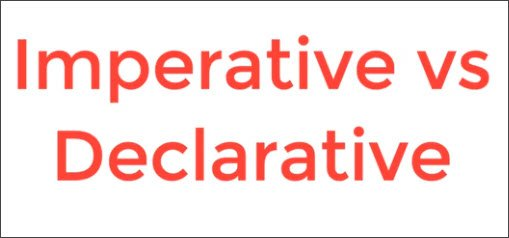
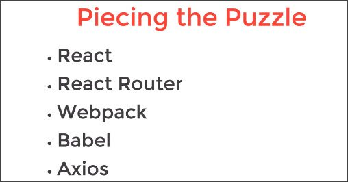

<!-- markdownlint-disable MD022 MD024 MD032 -->
# React Fundamentals
[<– back to React Fundamentals Code Notes homepage](index.html)

---

<!-- These are notes on [Tyler McGinnis' React Fundamentals](https://learn.tylermcginnis.com/courses) course. -->

## 1. Why React

- Composition
- Declarative
- Unidirectional Dataflow
- Explicit Mutations
- Just JavaScript

### 1.1 Composition

This is really means the composition of components.

It allows you to take a certain functionality of a small piece of your application and wrap or encapsulate it into it's own isolated container.

[](./assets/images/1.jpg)

For example, a `<Map />` component will have a lot going on. It may have some state as to the specific location of the map. It may need to make Ajax requests as we scroll in order to update the map images.

What we've done is really taken all the complexity of what is going on for the map and abstracted it behind our `<Map />` component.

What's nice about the component model is the same intuition we use to think about related functions can be applied to components.

How do we build large applications in React? By building a bunch of small apps.

#### Instagram Composition
Here is a view of the Instagram interface. It is composed of many smaller components, each of which may have their own state.

[](./assets/images/2.jpg)

#### Functional Composition
Here is an example of functional composition.

```js
var getProfilePic = function (username) {
  return 'https://photo.fb.com/' + username
}

var getProfileLink = function (username) {
  return 'https://www.fb.com/' + username
}

var getAvatarInfo = function (username) {
  return {
    pic: getProfilePic(username),
    link: getProfileLink(username)
  }
}

getAvatarInfo('tylermcginnis')
```

What we are doing inside of `getAvatarInfo` is we are calling `getProfilePic` and `getProfileLink`.

By doing this we are composing functions together in order to get an object with a `pic` property as well as a `link` property.

What's nice about React is we can use the same intuition we have about functions in order to compose our UI out of components.

#### Component Composition
Here's an example of the same functionality built with components.

```jsx
var ProfilePic = function() {
  return (
    
  )
}

var ProfileLink = function() {
  return (
    <a href={'https://www.fb.comn/' + this.props.username}>
      {this.props.username}
    </a>
  )
}

var Avatar = function() {
  return (
    <div>
      <ProfilePic username={this.props.username} />
      <ProfileLink username={this.props.username} />
    </div>
  )
}

<Avatar username="tylemcginnis" />
```

So instead of composing two functions into another function, we are composing two components into another component.

> The important take-away here is not to get hung up on the implementation, but rather, grasp the idea of separating your interface into components, and then composing those components together.
>
> That's what makes React so powerful is the idea of encapsulating all this complexity into specific components, then composing those components together in order to build the interface.

### 1.2 Declarative

[](./assets/images/3.jpg)

#### Imperative
When write imperative code you are telling the computer **How** to do something.

```js
// Imperative (How)

var numbers = [4,2,3,6]
var total = 0
for (var i = 0; i < number.length; i++) {
  total += numbers[i]
}
```

It the example we are explicitly telling the computer how to add up the numbers by looping through the array and adding to `total` on each iteration.

#### Declarative
When we write declarative code we tell the computer **What** to do.

```js
// Declarative (What)

var numbers = [4,2,3,6]
numbers.reduce(function (previous, current) {
  return previous + current
})
```

Here we are just telling the computer what we want to happen. We want to add the previous item to the current item.

We don't need to concern ourselves with How `.reduce` does this. There is some level of abstraction here and we are trusting the abstraction of `.reduce`.

#### Benefits of Declarative Programming

- Reduce side-effects
- Minimize mutability
- More readable code
- Less bugs

##### Side-effects
In functional programming whenever you are modifying state, or mutating something, or making API requests... those are referred to as side-effects.

By having declarative code, you are reducing the amount of side-effects in your code.

##### Mutability
In our iterative example we have the `total` variable which we are changing on every iteration of the loop. Since we are modifying it on on every iteration, we can't reliably trust it's going to be a certain value at any given time.

In the declarative example we are actually not modifying state, because all of that state modification is happening under the hood of `.reduce`.

Not only are we minimizing side-effects, but we are also minimizing the amount of mutating we are doing to state which is going to make our programs more stable and consistent.

##### More readable
Many times declarative code is going to be more readable because we are not having to mentally iterate through the loop in order to understand what is happening.

##### Less bugs
Because there's less mutability, we introduce less bugs into our code.

#### Imperative vs Declarative Example
Eating at a restaurant.

##### Imperative
You walk in and tell the host, I'd like to:

- walk over to that table
- be given a menu
- decide what I want
- give the waiter my order
- be served my food
- eat

This is very focused on **How**.

##### Declarative
You walk into a restaurant and tell the host, "I am here with my significant other, Do you have a table for two?"

This is focused on the **What**. We are trusting that the host will be able to accommodate the request without us providing explicit intstructions on how this is to be accomplished.

#### Is React Declarative

[](./assets/images/4.jpg)

Here is jQuery code that is very imperative because we are telling the computer **How** to handle the state.

##### Imperative

```js
$("#btn").click(function() {
  $(this).toggleClass("highlight")
  $(this).text() === 'Add Highlight'
    ? $(this).text('Remove Highlight')
    : $(this).text('Add Highlight')
})
```

##### Declarative

```html
<TylersBtn
  onClick={this.handleToggleHighlight}
  highlight={this.state.highlight} />
```

Here we have a React component called `TylersBtn`. It runs `handleToggleHighlight` whenever a user clicks the button. We pass in a highlight property which comes from `this.state.highlight`.

State is now being managed from inside the component rather than being managed in the DOM.

Additionally, we can just look at the component to know what is going on rather than have to step through the jQuery in order to know what's happening.

#### Why "for the most part"
Because we need to call `setState` in order to set the `highlight` property and this is very imperative.

```js
this.setState({
  highlight: !this.state.highlight
})
```

### 1.3 Unidirectional Data Flow

[](./assets/images/5.jpg)

The only difference between a static website and a complex web app is **state**.

A static website is probably never going to break because it doesn't have to manage state. FaceBook manages a bunch of state inside the app and therefore, manages lots of data.

> The main purpose of React is for managing state inside your application.
>
> The UI in React is really just a function of your state.

[](./assets/images/6.jpg)

As the state updates, the UI is going to update as well. All we really need to do is worry about manageing state in our app for the UI to update according to that state.

### 1.4 Explicit Mutations
[](./assets/images/7.jpg)

Whenever we want to update the state in our application, we have to call `setState`.

```js
this.setState({
  highlight: !this.state.highlight
})
```

What `setStat` is going to do is update the state in the application but it's also going to kick off a re-render.

> Whenever state is updated or whenever we call `setState`, it kicks off a re-render & updates the UI.
>
> In order to update state in a React application, we have to call `setState`

Explicit Mutations means we are not setting eevent listeners or doing dirty checking. We are specifically calling `setState` so we know exactly when our UI will update. It updates when we explicitly call `setState`.

### 1.5 Just JavaScript

[](./assets/images/8.jpg)

The better you get at using React, the better you'll get at JavaScript.

The React API is pretty small because it relies heavily on the JS API.

```html
<ul>
  {friends.map(function (name) {
    return (
      <li>
        {name}
      </li>
    )
  })}
</ul>
```

Instead of using `ng-repeat` or some other API specific to a framework, we are using JavaScript's built-in methods.

## 2. The React Ecosystem
[](./assets/images/9.jpg)

The React ecosystem is made up of these five basic areas.

- React
- React Router
- Webpack
- Babel
- Axios

### 2.1 React
This is the core React framework.

### 2.2 React Router
This will allow us to map a specific URL with a specific component.

| URL | Active Component |
| --- | --- |
| foo.com | Home |
| foo.com/about | About |
| foo.com/topics | Topics |

```html
<Router>
  <div>
    <ul>
      <li><Link to="/">Home</Link></li>
      <li><Link to="/about">About</Link></li>
      <li><Link to="/topics">Topics</Link></li>
    </ul>

    <Router exact path="/" component={Home} />
    <Router path="/about" component={About} />
    <Router path="/topics" component={Topics} />
  </div>
</Router>
```

We have html that renders three `<Link/>` components and below that we render three `<Router />` components.

The `<Router />` components say:

- If someone goes to "/" then render the `<Home />` component.
- If someone goes to "/about" then render the `<About />` component.
- If someone goes to "/topics" then render the `<Topics />` component.

The nice thing about React Router is that it's just components. `<Link />` is component and `<Router />`is a component that we are composing together.

### 2.3 Webpack
This is an extremely powerful tool that sometimes gets a bad wrap for being more complex than it actually is.

```js
var path = require('path);
var HtmlWebpackPlugin = require('html-webpack-plugin');

module.exports = {
  entry: './app/index.js',
  output: {
    path: path.resolve(__dirname, 'dist'),
    filename: 'index_bundle.js'
  }
  module: {
    rules: [
      { test: /\.(js)$/, use: 'babel-loader' },
      { test: /\.css$/, use: { 'style-loader', 'css-loader' }}
    ]
  },
  plugins: [
    new HtmlWebpackPlugin({
      template: 'app/index.html'
    })
  ]
};
```

What's happening is `index.js` is the entry point and it is going to become the root component in our application.

Webpack will take all the js files along with each `require` statement and run them through the transformations defined under rules.

It'll then bundle all the files into one file, output it to the `dist` folder, and name it `index_bundle.js`

> Webpack is really just a code bundler.
>
> It takes our code in our modules, transforms them, and bundles them.

### 2.4 Babel

> Babel is a code transformer

```json
"babel": {
  "presets": [
    "env",
    "react"
  ]
}
```

These transformations happen through Webpack and we run two types of transformations.

- `env` - ES6 transformations
- `react` - jsx transformations

### 2.5 Axios
Provides a uniform way of making Ajax requests

```js
function getRepos (username) {
  return axios.get('https://api.gitgub.com/users/' + username + '/repos' +
    param + '&per_page=100' );
}
```

## 3. Imperative vs Declarative
Imperative says **How** and declarative says **What**.

### 3.1 Declarative Languages

Here are some programming languages and where they fall on the spectrum.

| Imperative | Declarative | Mix (Can be) |
| --- | --- | --- |
| C, C++, Java | SQL, HTML | JavaScript, C#, Python |

Here are a couple examples of declarative syntax.

#### SQL

```sql
SELECT * FROM Users WHERE Country='Mexico';
```

#### HTML

```html
<article>
  <header>
    <h1>Declarative Programming</h1>
    <p>Some text about declarative programming</p>
  </header>
</article>
```

### 3.2 Imperative JavaScript

Next we're going to create some imperative code.

1. Write a function called *double* which takes in an array of numbers and returns a new array after doubling every item in that array. *double*([1,2,3]) -> [2,4,6]
   ```js
   function double (arr) {
     let results = []
     for (let i = 0; i < arr.length; i++){
       results.push(arr[i] * 2)
     }
     return results
   }
   ```
2. Write a function called *add* which takes in an array and returns the result of adding up every item in the array. *add*([1,2,3]) -> 6
  ```js
   function add (arr) {
     let result = 0
     for (let i = 0; i < arr.length; i++){
       result += arr[i]
     }
     return result
   }
   ```
3. Using jQuery, add a click event handler to the element which has an id of btn. When clicked, toggle (add or remove) the highlight class as well as change the text to Add Highlight or Remove Highlight depending on the current state of the element.
   ```js
   $("#btn").click(function() {
     $(this).toggleClass("highlight")
     $(this).text() === 'Add Highlight'
       ? $(this).text('Remove Highlight')
       : $(this).text('Add Highlight')
   })
   ```

After examining these three here's what we can say about them.

1. They each describe **How** to do something. We are explicitly iterative over an array or explicitly laying out steps for how to implement the functionality we want.
2. Each example is mutating some piece of state. In the first two we create a variable called `result` and then constantly modify it. The last example tracks state in the DOM rather than in a component.
3. The code isn't very readable. We can't just glance at the code to see what's going on. We actually have to step through it like an interpreter would while also taking into account the context in which the code lives.

### 3.3 Declarative JavaScript
Here we are going to re-write the code to say **What** we want.

1. Create a function to *double* the numbers in an array.
   ```js
   function double (arr) {
     return arr.map(item => item * 2)
   }
   ```
2. Create a function to *add* the numbers in an array and return the sum.
   ```js
   function add (arr) {
     return arr.reduce((prev, current) => prev + current);
   }
   ```
3. Create a highlight toggle component.
   ```html
   <Btn
     onToggleHighlight={this.handleToggleHighlight} 
     highlight={this.state.highlight}>
     {this.state.buttonText}
   </Btn>
  ```

In the first two examples we're using JavaScript's build-in `.map` and `.reduce` methods which provides an abstraction over some imperative implementation.

We are also not mutating any state. The mutations are abstracted inside of *map* and *reduce*.

The third example uses React. By looking at the component we can easily understand what the UI is going to look like. Another benefit is the state is living in the component itself rather than the DOM.

Another benefit of declarative code is that it is not context-dependant. This means the same code can be used in different programs because it is concerned with **What** is supposed to happen rather than the steps it takes to accomplish that goal.

If we look at our three examples above, we can consume those in any program we want. They're program agnostic. That is hard to do with imperative code because often times imperative code relies on the context of the current state.

Functional programming is a subset of declarative programming. We can start getting familiar with functional programming techniques by starting with `.map`, `.reduce`, and `.filter`.

#### Definitions

> Declarative programming is “the act of programming in languages that conform to the mental model of the developer rather than the operational model of the machine”.

> 3 types of programming languages
> - Procedural languages specify an explicit sequence of steps to follow
> - Imperative languages specify explicit manipulation fo the computer's internal state
> - Decarative languages express the logic of the computation without describing its control flow